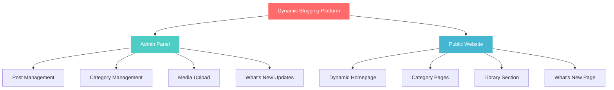

<!-- LOGO IMAGE - Add your logo here -->
<p align="center">
  
</p>

<!--- Animated Header --->
<p align="center">
    
</p>

<!-- MAIN TITLE -->
<p align="center">
  
</p>

<!-- MODULE BADGES - CLEAN HEADER -->
<p align="center">
  
  
  
  
  
  
</p>

<!-- VERSION BADGES -->
<p align="center">
  
  
  
  
  
</p>

<!-- REPO STATS -->
<p align="center">
  
  
  
</p>

---

<!-- ASCII ART HEADER -->
<pre align="center">
╔═══════════════════════════════════════════════════════════════════╗
║  ██████╗  ██████╗  ██████╗ ██╗███╗   ██╗ ██████╗                 ║
║  ██╔══██╗██╔════╝ ██╔════╝ ██║████╗  ██║██╔════╝                 ║
║  ██║  ██║██║  ███╗██║  ███╗██║██╔██╗ ██║██║  ███╗                ║
║  ██║  ██║██║   ██║██║   ██║██║██║╚██╗██║██║   ██║                ║
║  ██████╔╝╚██████╔╝╚██████╔╝██║██║ ╚████║╚██████╔╝                ║
║  ╚═════╝  ╚═════╝  ╚═════╝ ╚═╝╚═╝  ╚═══╝ ╚═════╝                 ║
║                                                                   ║
║              Dynamic Blogging Platform v1.0                      ║
║         Laravel + SQLite Content Management System               ║
╚═══════════════════════════════════════════════════════════════════╝
</pre>

---

## 📋 NAVIGATION MENU

<p align="center">
  <a href="#-overview"></a>
  <a href="#-features"></a>
  <a href="#-architecture"></a>
  <a href="#-tech-stack"></a>
  <a href="#-installation"></a>
  <a href="#-future-improvements"></a>
  <a href="#-license"></a>
</p>

---

## OVERVIEW

A **dynamic blogging and content management platform built with Laravel** that allows authors to publish structured articles with rich media support. The system supports **image uploads, YouTube video embeds, structured content formatting (titles, subtitles, lists), and category-based organization**.

The platform is divided into two main parts:

* **Admin Panel** – for managing content and categories
* **Public Website** – for visitors to browse articles and updates

It also includes a **dynamic homepage, categorized library, and a "What's New" section** showing recent posts grouped by categories.



---

## FEATURES

### Admin Panel

The admin dashboard allows content managers to control the platform with the following capabilities:

| Feature | Description |
|:--------|:------------|
| Post Management | Create, edit, and delete posts with full content control |
| Image Upload | Upload and manage images for articles |
| YouTube Integration | Add YouTube video links to posts |
| Category Management | Create, edit, and organize content categories |
| Library Organization | Organize posts inside the categorized library |
| What's New Management | Control which updates appear in the What's New section |

---

### Public Website

Visitors can browse content through several dynamic sections.

#### Dynamic Homepage
- Displays featured and recent posts
- Automatically updates when new articles are published
- Clean, responsive design for all devices

#### Categories Pages
- Articles are organized into logical categories
- Each category page displays related content
- Easy navigation between categories

#### Library Section
- A categorized content library for easy browsing
- Helps users discover resources and articles
- Filter and sort capabilities

#### What's New Page
- Shows recently published articles
- Organized by categories for quick discovery
- Helps users stay updated with latest content

---

## ARCHITECTURE

```
┌─────────────────────────────────────────────────────────────────┐
│                    DYNAMIC BLOGGING PLATFORM                     │
├─────────────────────────────────────────────────────────────────┤
│                                                                  │
│  ┌──────────────────┐              ┌──────────────────┐        │
│  │   ADMIN PANEL    │              │  PUBLIC WEBSITE  │        │
│  │                  │              │                  │        │
│  │ • Dashboard      │              │ • Homepage       │        │
│  │ • Posts CRUD     │◄────────────►│ • Category Pages │        │
│  │ • Categories     │   Database    │ • Library        │        │
│  │ • Media Library  │   Layer       │ • What's New     │        │
│  │ • Settings       │              │ • Article View   │        │
│  └──────────────────┘              └──────────────────┘        │
│           │                                 │                   │
│           └──────────────┬──────────────────┘                   │
│                          │                                      │
│                    ┌─────▼─────┐                               │
│                    │  SQLite   │                               │
│                    │ Database  │                               │
│                    └───────────┘                               │
│                                                                  │
│  ┌──────────────────────────────────────────────────────────┐  │
│  │                    MEDIA HANDLING                         │  │
│  │  ┌────────────┐  ┌────────────┐  ┌────────────────────┐  │  │
│  │  │   Images   │  │  YouTube   │  │ Structured Content │  │  │
│  │  │   Upload   │  │   Embeds   │  │  (Titles, Lists)   │  │  │
│  │  └────────────┘  └────────────┘  └────────────────────┘  │  │
│  └──────────────────────────────────────────────────────────┘  │
│                                                                  │
└─────────────────────────────────────────────────────────────────┘
```

---

## TECH STACK

| Technology | Version | Purpose |
|:-----------|:-------:|:--------|
| Laravel | 10.x | Backend PHP framework |
| PHP | 8.1+ | Core programming language |
| Blade | - | Template engine |
| SQLite | 3.x | Lightweight database |
| JavaScript | ES6 | Frontend interactions |
| CSS3 | - | Styling and responsive design |
| HTML5 | - | Page structure |

---

## MEDIA SUPPORT

The platform supports rich content inside articles:

* **Image uploads** with automatic optimization
* **YouTube video embeds** for multimedia content
* **Structured article formatting** for professional layouts

Content elements supported:

* Titles and headings
* Subtitles and subheadings
* Bullet and numbered lists
* Inline images with captions
* Video embeds with responsive players

---

## INSTALLATION

### Step 1: Clone the repository

```bash
git clone https://github.com/yourusername/your-repo.git
cd your-repo
```

### Step 2: Install dependencies

```bash
composer install
```

### Step 3: Create environment file

```bash
cp .env.example .env
```

### Step 4: Generate application key

```bash
php artisan key:generate
```

### Step 5: Configure SQLite database

Create the database file:

```bash
touch database/database.sqlite
```

Edit `.env` file:

```env
DB_CONNECTION=sqlite
DB_DATABASE=/absolute/path/to/your/project/database/database.sqlite
```

### Step 6: Run migrations

```bash
php artisan migrate
```

### Step 7: Start the development server

```bash
php artisan serve
```

Visit in browser:

```
http://127.0.0.1:8000
```

---

## FUTURE IMPROVEMENTS

| Feature | Description |
|:--------|:------------|
| Rich Text Editor | Enhanced WYSIWYG editor for post creation |
| Search Functionality | Full-text search across all content |
| Tag System | Additional content organization with tags |
| Comments System | User engagement through comments |
| API Support | RESTful API for headless CMS capabilities |
| User Roles | Multi-level permissions for contributors |
| SEO Optimization | Meta tags and SEO-friendly URLs |
| Social Sharing | Built-in social media sharing buttons |

---

## LICENSE

This project is licensed under the **MIT License**.

```
MIT License

Copyright (c) 2024 Your Name

Permission is hereby granted, free of charge, to any person obtaining a copy
of this software and associated documentation files (the "Software"), to deal
in the Software without restriction, including without limitation the rights
to use, copy, modify, merge, publish, distribute, sublicense, and/or sell
copies of the Software, and to permit persons to whom the Software is
furnished to do so, subject to the following conditions:

The above copyright notice and this permission notice shall be included in all
copies or substantial portions of the Software.

THE SOFTWARE IS PROVIDED "AS IS", WITHOUT WARRANTY OF ANY KIND, EXPRESS OR
IMPLIED, INCLUDING BUT NOT LIMITED TO THE WARRANTIES OF MERCHANTABILITY,
FITNESS FOR A PARTICULAR PURPOSE AND NONINFRINGEMENT. IN NO EVENT SHALL THE
AUTHORS OR COPYRIGHT HOLDERS BE LIABLE FOR ANY CLAIM, DAMAGES OR OTHER
LIABILITY, WHETHER IN AN ACTION OF CONTRACT, TORT OR OTHERWISE, ARISING FROM,
OUT OF OR IN CONNECTION WITH THE SOFTWARE OR THE USE OR OTHER DEALINGS IN THE
SOFTWARE.
```

---

<!-- FOOTER -->
<p align="center">
    
</p>

<p align="center">
  
  
  <br>
  <sub>© 2024 Dynamic Blogging Platform. MIT License.</sub>
</p>

<p align="center">
  
</p>
